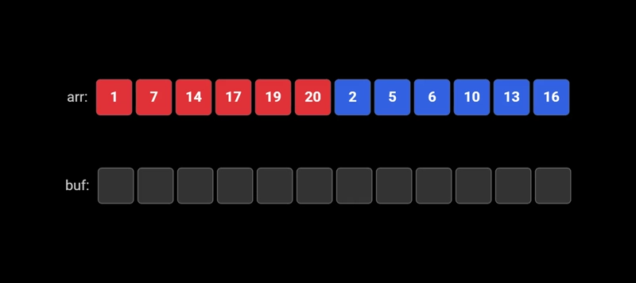
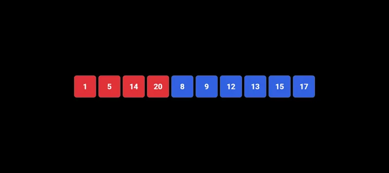

# O(n) 原地归并的不稳定版本

讲一个很有意思的学术算法，一个线性时间原地归并算法。

这一期是不稳定版本，下一期我们会讲稳定版本。以稳定版本为基础，归并排序可以同时满足稳定、原地、$O(n\log n)$ 时间，可以说非常神奇了。

算法主要参考这两篇论文，细节上会有修改：

1. [Practical in-place merging](https://doi.org/10.1145/42392.42403) 这是不稳定版本。
2. [Fast Stable Merging and Sorting in Constant Extra Space](https://doi.org/10.1093/comjnl/35.6.643) 这是稳定版本。

[WikiSort](https://github.com/BonzaiThePenguin/WikiSort) 也值得一看，是稳定版本。

另外 [Sorting stably, in-place, with O(n log n) comparisons and O(n) moves](https://doi.org/10.1007/978-3-540-31856-9_52) 这个排序比本文的结论更强，多了 $O(n)$ 次移动的限制，可能是理论上最完美的排序。但是过于复杂看不懂喵。

## 1. 原地归并是什么

原地合并两个有序数组，输入是一个长度为 n 的数组 arr 和一个位置 pos，`arr[0] ... arr[pos - 1]` 属于第一个有序数组 A，`arr[pos] ... arr[n - 1]` 属于有序数组 B，merge 的结果是合并两个有序数组为 `arr[0] ... arr[n]`。

“原地”其实有两种含义，一是算法的结果直接写回原数组，比如 C++ `std::inplace_merge` 就是这个含义；二是 $O(1)$ 的额外空间复杂度，有时会允许 $O(\log n)$ 的递归栈，这篇文章的“原地”都是这个含义。

## 2. 一些前置算法

双指针归并和区间旋转在我之前文章有讲，我就直接复制过来。

### 2.1. 双指针归并算法

两个指针指向两个数组的开始位置，不断把较小元素放到 buffer 数组，对应指针向后移动。最后把 buffer 里的元素移动回原数组。

这个过程如下图所示：



这个算法在 C++ [std::inplace_merge](https://en.cppreference.com/w/cpp/algorithm/inplace_merge.html) 里亦有记载（如果空间够的话）。

### 2.2. 缓冲区双指针归并算法

传统的双指针归并不是原地算法，需要进行改造。假设一个数组，按顺序是长度 right_len（或大于 right_len）的缓冲区，长度 left_len 的数组 A，长度 right_len 的数组 B，使用双指针归并将 A 和 B 归并在数组开头。

缓冲区的元素不能丢弃，因此使用交换来移动元素。

```cpp
template <typename T>
void merge_with_swap(T* output, T* first, T* mid, T* last) {
    T* left_ptr = first;
    T* right_ptr = mid;
    while (left_ptr < mid || right_ptr < last) {
        if (right_ptr == last || (left_ptr < mid && *left_ptr <= *right_ptr)) {
            std::swap(*output, *left_ptr);
            output++;
            left_ptr++;
        } else {
            std::swap(*output, *right_ptr);
            output++;
            right_ptr++;
        }
    }
}
```

这里 output 一开始指向缓冲区首元素。output 不会追上 left_ptr，因为如果 left_ptr 指针右移，output 指针和 left_ptr 的距离不变；而 right_ptr 指针右移的次数只有 right_len 次（数组 B 的长度），刚好是缓冲区大小。

### 2.3. rotate 区间旋转算法

原地算法基本绕不开 rotate（区间旋转），把两个相邻区间 `[A B]` 原地变成 `[B A]`，保持区间内部顺序不变。这个方法不唯一，最经典的做法是三次翻转法（或手摇算法）：先分别翻转区间 A 和区间 B，再整体翻转整个区间 `[A B]`，就能得到 `[B A]`。

这个过程如下图所示：



这个算法在 C++ [std::rotate](https://en.cppreference.com/w/cpp/algorithm/rotate.html) 里亦有记载。当然标准库会根据数据量采用不同算法，这里就不深究了。

### 2.4. 旋转归并算法

旋转归并算法也是合并两个有序数组，基于 rotate，因此不需要额外空间。

一开始是两个有序数组 `[A B]`，不断进行下面步骤：

1. 取 A 的第一个数 `A[0]`。
2. 将 B 划分为小于 `A[0]` 的区间 B1、大于等于 `A[0]` 区间 B2。
3. 通过 rotate 算法将 A 和 B1 交换。
4. `A[0]` 已经确定位置，剩下 A 的元素作为新的 A，B2 作为新的 B，回到步骤 1。

这个过程其实是用“批量”插入排序的方式完成 merge。

设 $l$ 是 A 的长度，$r$ 是 B 的长度。因为算法会循环 $l$ 次，所以 A 的每个数旋转 $O(l)$ 次，B 的每个数旋转 $O(1)$ 次，总时间复杂度 $O(l^2+r)$。

同理只要反一下就能做到 $O(l+r^2)$ 复杂度，在代码里我会根据数组长度来选择两种算法。

```cpp
template <typename T>
void inplace_merge_with_rotation(T* first, T* mid, T* last) {
    if (mid - first < last - mid) {  // 左数组向右滚动 O(l^2 + r)
        while (first < mid && mid < last) {
            T* split_right = mid;
            while (split_right < last && *split_right < *first) {
                split_right++;
            }
            std::rotate(first, mid, split_right);
            first += (split_right - mid) + 1;
            mid = split_right;
        }
    } else {  // 右数组向左滚动 O(l + r^2)
        while (first < mid && mid < last) {
            T* split_left = mid;
            while (split_left > first && *(split_left - 1) > *(last - 1)) {
                split_left--;
            }
            std::rotate(split_left, mid, last);
            last -= (mid - split_left) + 1;
            mid = split_left;
        }
    }
}
```

## 3. 不稳定原地归并 in O(n) time

这是一个分块算法，我们定义块大小 $s=\lfloor \sqrt{n} \rfloor$。

### 3.1. 分块和对齐

把 A, B 数组划分为大小 s 的块，不整除的部分（非对齐部分）用 rotate 算法移动到 B 数组的后面。不整除的部分在最后一步会处理。

```cpp
template <typename T>
void unstable_inplace_merge(T* first, T* mid, T* last) {
    size_t left_len = mid - first;
    size_t right_len = last - mid;
    size_t block_size = std::floor(std::sqrt(left_len + right_len));
    size_t left_aligned_len = left_len / block_size * block_size;
    size_t right_aligned_len = right_len / block_size * block_size;
    size_t aligned_len = left_aligned_len + right_aligned_len;

    std::rotate(first + left_aligned_len, mid, mid + right_aligned_len);

    /* 后续算法 */
}
```

### 3.2. 块间排序

所有块按首元素升序排序，首元素相同比较末尾元素，块内的顺序不变。

为什么要这么排序，首元素有序是为了块间合并步骤的一些前提，这个在块间合并步骤会讲。而比较末尾元素，是处理块内都是相同值的情况。例如一块是 `[1, 1, 1, 1]`，另一块 `[1, 1, 2, 2]`，比较末尾元素可以避免第二块放在第一块前面。

由于交换两个块的代价很大，我们需要每个块只要交换 $O(1)$ 次的排序，用什么排序呢？没错，就是选择排序。

比较次数 $(n/s)^2 \approx (\sqrt{n})^2=n$，交换次数 $s(n/s)=n$，因此总复杂度 $O(n)$。

```cpp
template <typename T>
void block_selection_sort(T* first, T* last, size_t block_size) {
    for (T* cur = first; cur < last; cur += block_size) {
        T* min = cur;
        for (T* scan = cur + block_size; scan < last; scan += block_size) {
            if (std::pair{*min, *(min + block_size - 1)} > std::pair{*scan, *(scan + block_size - 1)}) {
                min = scan;
            }
        }
        if (min != cur) {
            std::swap_ranges(cur, cur + block_size, min);
        }
    }
}
```

### 3.3. 块间合并

这是最核心的一个步骤。

我们需要大小为 s 的缓冲区来完成这一步骤，考虑把第一块的数划为缓冲区。

1. 利用第 i 块为缓冲区对第 `i + 1` 块、第 `i + 2` 块进行双指针归并。注意不能丢失缓冲区的数，所以要用缓冲区双指针归并算法。这一步后缓冲区的数会转移到第 `i + 2` 块的位置。
2. 交换第 `i + 1` 块和第 `i + 2` 块，如果是 `i + 2` 是最后一块就不用。
3. i 增加 1，回到步骤 1。

块间合并完后除了缓冲区，所有块都整体有序。

为什么算法可行呢？因为，我们每次归并的是首元素最小的两个块（不考虑缓冲区）。

如果首元素最小的两块一开始属于同一数组，假设是数组 A。显然数组 B 的最小值大于等于第二块首元素，也就大于等于前一块的所有数。因此第一块就是最小的 s 个数。

如果首元素最小的两块一开始属于不同的数组（一块属于 A，一块属于 B），这两块已经包含了数组 A 和数组 B 的最小的 s 个数，因此最小的 s 个数只会出现在这两块里。

单次双指针归并 $O(s)$ 次交换，一共 $O(n/s)$ 次归并，所以总复杂度 $O(n)$。

```cpp
template <typename T>
void block_merge_pairwise(T* first, T* last, size_t block_size) {
    size_t n_blocks = (last - first) / block_size;
    for (size_t i = 0; i + 2 < n_blocks; i++) {
        merge_with_swap(first + i * block_size, first + (i + 1) * block_size,
                        first + (i + 2) * block_size,
                        first + (i + 3) * block_size);
        if (i + 3 < n_blocks) {
            std::swap_ranges(first + (i + 1) * block_size,
                             first + (i + 2) * block_size,
                             first + (i + 2) * block_size);
        }
    }
}
```

### 3.4. 处理尾部元素

我们把缓冲区移动到后面，和非对齐部分一起统称尾部元素。非对齐部分长度不大于 2s，缓冲区长度 s，因此尾部元素长度不超过 3s。

首先对尾部元素进行排序，用任意一个平方复杂度的排序即可，例如冒泡。这里的复杂度是 $O((3s)^2)=O(n)$。

用旋转归并算法把前面部分（长度不超过 n）和尾部元素（长度不超过 3s）合并为一个有序数组。这里的复杂度是 $O(l+r^2)=O(n+(3s)^2)=O(n)$。

```cpp
template <typename T>
void bubble_sort(T* first, T* last) {
    size_t len = last - first;
    for (size_t i = 0; i + 1 < len; i++) {
        for (T* j = first; j < last - i - 1; j++) {
            if (*j > *(j + 1)) {
                std::swap(*j, *(j + 1));
            }
        }
    }
}

template <typename T>
void unstable_inplace_merge(T* first, T* mid, T* last) {
    /* 前面几个步骤 */

    bubble_sort(first + aligned_len - block_size, last);
    inplace_merge_with_rotation(first, first + aligned_len - block_size, last);
}
```

## 4. 补个代码

[完整实现](https://github.com/axiomofchoice-hjt/TCS-Algorithms/blob/master/include/tcs/inplace/unstable_merge.hpp)和[测试](https://github.com/axiomofchoice-hjt/TCS-Algorithms/blob/master/tests/inplace/test_unstable_merge.cpp)。

## 5. 稳定原地归并预告

不妨分析一下上面算法里什么操作破坏了稳定性。第一，“块间排序”里的选择排序是不稳定排序。第二，“块间合并”会把缓冲区打乱，同样导致不稳定。

我们会利用缓冲区作为 label 把算法稳定下来，思路类似带 index 的快速排序。细节有很多，就放到下一期讲了。
